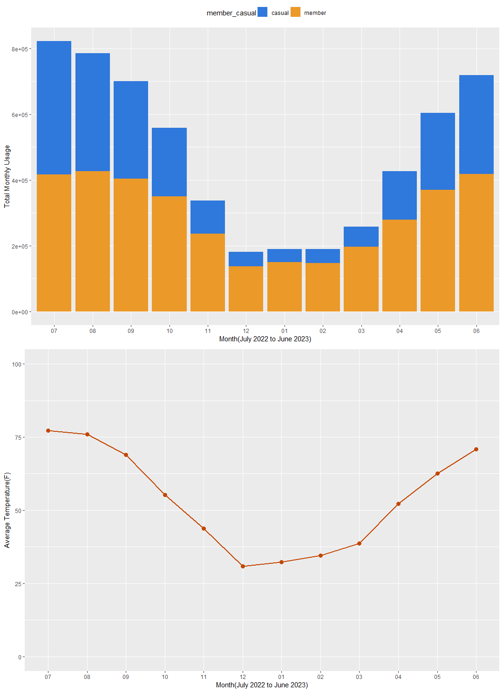
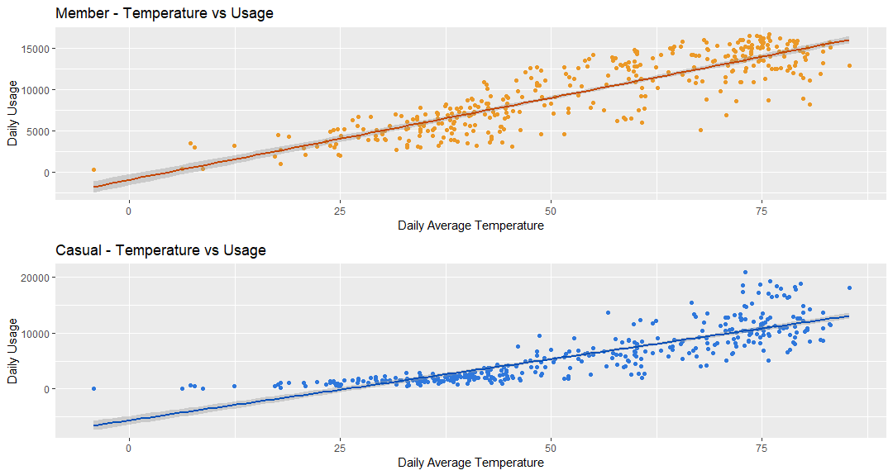
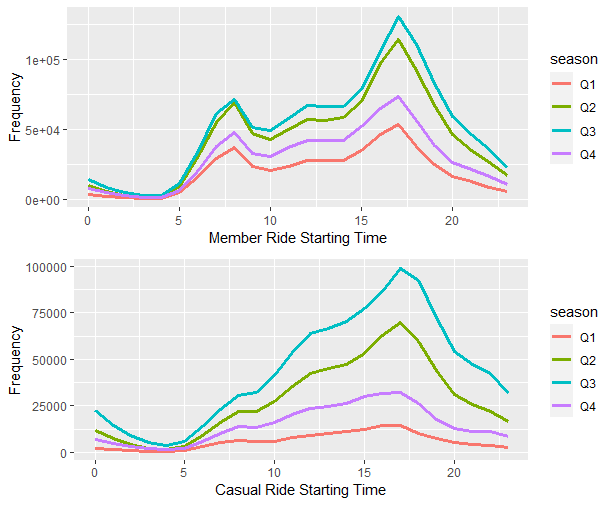
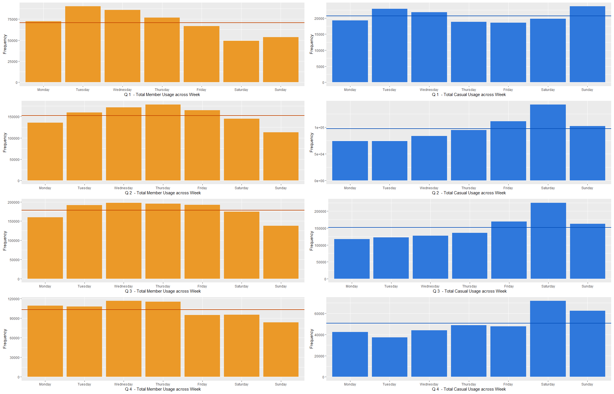
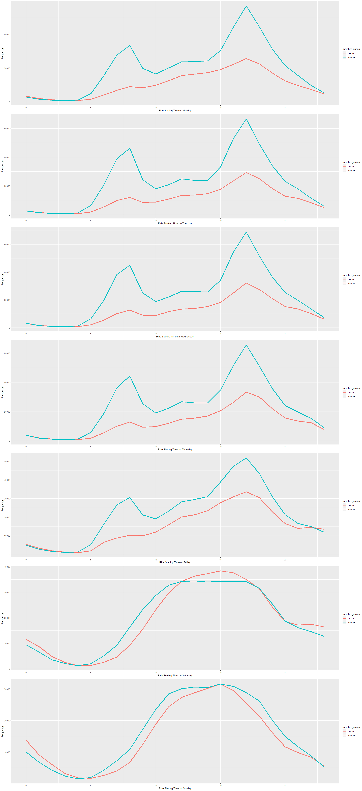
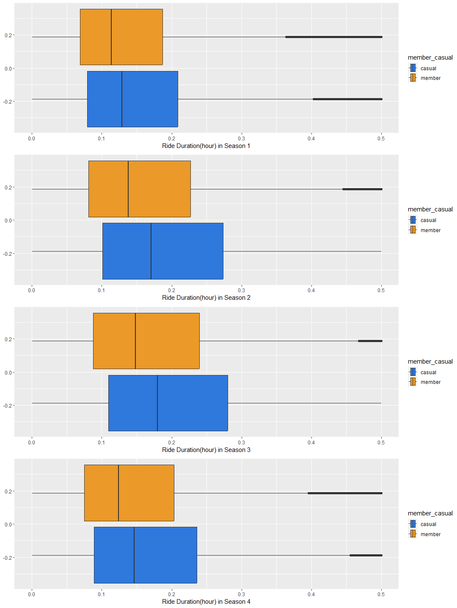

## Description

This is a markdown document created using R Markdown. This document is
intended to showcase my work in the Cyclistic Data Analytics Case Study.

## Business Task

### Main Goal

-   Understand how casual riders and annual members use Cyclistic bikes
    differently
-   Design a new marketing strategy to convert casual riders into annual
    members.

### Main Stakeholders

-   Lily Moreno: The director of marketing and data analysts’ manager.
-   Cyclistic executive team: A notoriously detail-oriented executive
    team that is going to make the final decision on adoption of our
    marketing plan.

## Data Source

### Data Source Description

Cyclistic trip data
(<https://divvy-tripdata.s3.amazonaws.com/index.html>)

-   This dataset describes data collected by Divvy Bikes, a bike-sharing
    company that operates in Chicago.

-   The dataset contains data about individual trips by Divvy Bikes
    users and also data about Divvy Bikes’s bike sharing stations that
    allow users to collect and release their bike.

-   There are data from 2013 to 2023 in the dataset. In this case study,
    I will take the most recent 5 years of data to do my analysis. This
    selection of range is because data from too long ago has lost its
    credibility to deduce insight/conclusion for current time. Also, the
    COVID-19 pandemic outrage clearly has a huge impact on people’s
    mobilization and commute. As the pandemic has now become endemic,
    the society is experiencing a huge change. The data from 2020-2021
    may not be that reliable to deduct conclusion about current and the
    future. Including data from 2019 also allows me to compare it with
    data from 2022 to 2023.

### Data Organization

|        Column name |  Data Type   | Description                                                         |
|------------:|:-----------:|:----------------------------------------------|
|            ride_id | quantitative | Unique ID for an individual trip                                    |
|      rideable_type | qualitative  | The type of the bike used in this trip                              |
|         started_at | quantitative | Starting time of the trip                                           |
|           ended_at | quantitative | Ending time of the trip                                             |
| start_station_name | qualitative  | The name of starting station                                        |
|   start_station_id | qualitative  | The ID of starting station                                          |
|     end_station_id | qualitative  | The ID of ending station                                            |
|   end_station_name | qualitative  | The name of ending station                                          |
|          start_lat | quantitative | The latitude of the starting position                               |
|          start_lng | quantitative | The longitude of the starting position                              |
|            end_lat | quantitative | The latitude of the ending position                                 |
|            end_lng | quantitative | The longitude of the ending position                                |
|      member_casual | qualitative  | Whether or not the user is classified as member or as a casual user |
|                    |              |                                                                     |

From the raw data’s organization, we can see that there are numerous
repeated instances of latitude, longitude, station name information. As
the data is also kinda huge, it would be great if we re-organize the
data to store it in a database for further actions & maintenance. If I
am to re-organize the data, the database schema would be:

    CREATE TABLE station(
      station_id varchar(20) PRIMARY KEY,
      station_name varchar(50),
      lng decimal(10,3),
      lat decimal(10,3),
    );

    CREATE TABLE ride(
      ride_id varchar(30) PRIMARY KEY,
      rideable_type varchar(20),
      started_at datetime,
      ended_at datetime,
      start_station_id varchar(20) FOREIGN KEY REFERENCES station(station_id),
      end_station_id varchar(20) FOREIGN KEY REFERENCES station(station_id),
      member_casual integer
    );

### Problems with the data

-   The data is stored separately in several CSV files, in which some of
    them have different organizations from others, so a data merging
    process needs to be done.
-   Missing values presented, some inconsistency in station name
    observed(some data adds ’\*’ after station name),needs data
    cleaning.
-   Inconsistency between user type across year, also inconsistency
    between matching of station id to station name, all this needs to be
    addressed when doing data merging.
-   Also some data was not collected in years before 2020(gender,
    birthyear), and some not collected after it(longitude and latitude).
-   The dataset is lack of demographic data about the users, which may
    be due to a privacy concern.

## Data Transformation & Cleaning

I took a year of data (from 2022 July to 2023 June) to do the analysis
in order to study seasonal factors. As one year of data is huge to
process to see immediate result, I did the data cleaning &
transformation season-wise, combining 3 months of data into a season,
clean the data, and store it in a single CSV file.

Below is code chunk demonstration for one season

Load the data files

``` r
dirQ1 <- paste(getwd(),r"(/Data/2023Q1)",sep="")
filesQ1 <- list.files(path=dirQ1, pattern=NULL, all.files=FALSE,full.names=FALSE)

dataQ1 <- data.frame()
for (file in filesQ1){
  dataQ1 <- rbind(dataQ1,data.frame(read_csv(paste(dirQ1,"\\",file,sep=""))))

}
```

Glimpse the combined raw data

``` r
glimpse(dataQ1)
```

    ## Rows: 639,424
    ## Columns: 13
    ## $ ride_id            <chr> "F96D5A74A3E41399", "13CB7EB698CEDB88", "BD8…
    ## $ rideable_type      <chr> "electric_bike", "classic_bike", "electric_b…
    ## $ started_at         <dttm> 2023-01-21 20:05:42, 2023-01-10 15:37:36, 2…
    ## $ ended_at           <dttm> 2023-01-21 20:16:33, 2023-01-10 15:46:05, 2…
    ## $ start_station_name <chr> "Lincoln Ave & Fullerton Ave", "Kimbark Ave …
    ## $ start_station_id   <chr> "TA1309000058", "TA1309000037", "RP-005", "T…
    ## $ end_station_name   <chr> "Hampden Ct & Diversey Ave", "Greenwood Ave …
    ## $ end_station_id     <chr> "202480.0", "TA1308000002", "599", "TA130800…
    ## $ start_lat          <dbl> 41.92407, 41.79957, 42.00857, 41.79957, 41.7…
    ## $ start_lng          <dbl> -87.64628, -87.59475, -87.69048, -87.59475, …
    ## $ end_lat            <dbl> 41.93000, 41.80983, 42.03974, 41.80983, 41.8…
    ## $ end_lng            <dbl> -87.64000, -87.59938, -87.69941, -87.59938, …
    ## $ member_casual      <chr> "member", "member", "casual", "member", "mem…

Remove duplicates

``` r
dataQ1 <- dataQ1[!duplicated(dataQ1),]
```

Check & remove missing values

``` r
# first of all check for missing values
for(col in colnames(dataQ1)){
  nas <- sum(is.na(dataQ1[col]))
  print(paste(col,nas))
}
```

    ## [1] "ride_id 0"
    ## [1] "rideable_type 0"
    ## [1] "started_at 0"
    ## [1] "ended_at 0"
    ## [1] "start_station_name 88104"
    ## [1] "start_station_id 88236"
    ## [1] "end_station_name 93016"
    ## [1] "end_station_id 93157"
    ## [1] "start_lat 0"
    ## [1] "start_lng 0"
    ## [1] "end_lat 426"
    ## [1] "end_lng 426"
    ## [1] "member_casual 0"

``` r
# quite a lot of missing values in station ids and station names
# a little(2853) missing values on ending latitude and longitude, which is around 0.1% ~ 0.15% of the data
# remove entries with missing values on ending latitude and longitude
dataQ1 <- dataQ1[!is.na(dataQ1$end_lat),]
dataQ1 <- dataQ1[!is.na(dataQ1$end_lng),]
```

Dealing with outliers - Define function to detect outliers using IQR

``` r
# use IQR to find outliers
detect_outliers <- function(x){
  q1 <- quantile(x,0.25)
  q3 <- quantile(x,0.75)
  IQR <- q3-q1
  x > q3 + (IQR*1.5) | x < q1 - (IQR*1.5)
}
```

Cleaning station name columns - defining a function for convenience

``` r
cleanStationName <- function(name){
  print(i)
  ## clean names with format "Public Rack - XXXX"
  name <- sub('Public Rack - ','',name)
  ## clean names with asterisk
  name  <- sub('\\*','',name)
  ## clean names with brackets
  name  <- sub('\\(','',name)
  name  <- sub('\\)','',name)
  ## trim station names
  name <- trimws(name)
  return(name)
}
```

Compute new values for analysis

Compute ride duration

``` r
## compute ride duration (in seconds)
ride_duration_sec <- as.POSIXct(dataQ1$ended_at, format="%Y-%m-%d %H:%M:%S", tz="UTC")-as.POSIXct(dataQ1$started_at, format="%Y-%m-%d %H:%M:%S", tz="UTC")
dataQ1$ride_duration_sec <- ride_duration_sec
dataQ1$ride_duration_hour <- dataQ1$ride_duration_sec/3600
```

Checking outliers for ride duration

``` r
hist(as.numeric(dataQ1$ride_duration_hour))
```


``` r
tt <- dataQ1$ride_duration_hour[detect_outliers(dataQ1$ride_duration_hour)]
tt <- as.numeric(tt)
outliers_duration_day <- rev(sort(tt))/24
# take a glimpse at the outliers
outliers_duration_day[1:50]
```

    ##  [1] 1.0416088 1.0415972 1.0415741 1.0415509 1.0415394 1.0401852
    ##  [7] 1.0394676 1.0325694 1.0287153 1.0282292 1.0233218 1.0197338
    ## [13] 1.0182523 1.0155671 1.0082755 1.0026968 1.0021412 0.9913657
    ## [19] 0.9887384 0.9886227 0.9878935 0.9877546 0.9857060 0.9650347
    ## [25] 0.9627662 0.9622454 0.9582870 0.9580903 0.9517824 0.9516898
    ## [31] 0.9474769 0.9452199 0.9425810 0.9418634 0.9383449 0.9361458
    ## [37] 0.9359491 0.9289468 0.9252662 0.9236690 0.9217245 0.9195718
    ## [43] 0.9178704 0.9161343 0.9144329 0.9122222 0.9113889 0.9092245
    ## [49] 0.9085069 0.9055093

``` r
# check if there is any outliers larger than 12 hours
nrow(dataQ1[dataQ1$ride_duration_hour>12,])
```

    ## [1] 234

``` r
# # given the statistical insignificance, it is reasonable to remove them all
dataQ1 <- dataQ1[dataQ1$ride_duration_hour<=12,]
## compute day of week
dataQ1$day <- weekdays(as_datetime(dataQ1$started_at))
dataQ1$day[1:20]
```

    ##  [1] "Saturday"  "Tuesday"   "Monday"    "Sunday"    "Thursday" 
    ##  [6] "Tuesday"   "Sunday"    "Wednesday" "Wednesday" "Friday"   
    ## [11] "Thursday"  "Tuesday"   "Monday"    "Tuesday"   "Thursday" 
    ## [16] "Monday"    "Saturday"  "Thursday"  "Tuesday"   "Tuesday"

``` r
## separate started_at to start_year,start_month,start_day,start_time
dataQ1$start_year <- year(as_datetime(dataQ1$started_at))
dataQ1$start_month <- month(as_datetime(dataQ1$started_at))
dataQ1$start_day <- day(as_datetime(dataQ1$started_at))
dataQ1$start_time <- format(as.POSIXct(dataQ1$started_at,format="%Y-%m-%d %H:%M:%S", tz="UTC"), format = "%H:%M")

dataQ1$end_year <- year(as_datetime(dataQ1$ended_at))
dataQ1$end_month <- month(as_datetime(dataQ1$ended_at))
dataQ1$end_day <- day(as_datetime(dataQ1$ended_at))
dataQ1$end_time <-format(as.POSIXct(dataQ1$ended_at,format="%Y-%m-%d %H:%M:%S", tz="UTC"), format = "%H:%M")
```

Check for outliers for computed values

``` r
# check for outliers : some data entries contain ride info that is way too long
# remove outlier in duration

# not a lot outliers found, only one 0
dataQ1$dist_km[detect_outliers(dataQ1$dist_km)]
```

    ## NULL

``` r
# check for invalid values : negative duration 
dataQ1$ride_duration_sec[dataQ1$ride_duration_sec<0]
```

    ## Time difference of -196 secs

``` r
# found 1, remove it
dataQ1 <- dataQ1[dataQ1$ride_duration_sec>0,]

# check for consistencies
unique(dataQ1$member_casual)
```

    ## [1] "member" "casual"

``` r
# output cleaned data for further usage
write.csv(dataQ1,paste(getwd(),r"(\Data\data2023_123_cleaned.csv)",sep=""),row.names=FALSE)
```

## Data Analysis

I found trends & relationships from the data & deduced insights from
them.

-   Trend 1: seasonal factors affect usage a lot and they affect casual
    users much more than member users, in cold seasons, casual users
    ride much less compared to warmer seasons.

-   Relationship 1: There are more member users usage than casual users
    usage

<center>

</center>
Linear regression to observe the relationship of temperature and daily
usage
<center>

</center>

------------------------------------------------------------------------

-   Trend 2: Casual users & member users have varying average usage
    distribution in a day.
    <center>
    
    </center>

------------------------------------------------------------------------

-   Trend 3: There is a huge discrepancy on rides distribution
    throughout the week: member users take rides more often on weekdays,
    and less on weekends.

<center>

</center>

Comparison of daily riding pattern across weeks: only on weekends their
distribution resemble, further verifying the insight that member users
focus more on commutation while casual users focus less

<center>

</center>

------------------------------------------------------------------------

-   Relationship 2: member has slightly shorter & less variable ride
    duration on average compared to casual usage
    <center>
    
    </center>

------------------------------------------------------------------------

### Insights Derived

-   Member users ride shared bikes for more stable & consistent
    activities, while casual users ride shared bikes for more versatile
    activities

-   Member users ride shared bikes mainly for commutation to and from
    workplaces, whilst casual users ride shared bikes mainly for other
    casual activities.

<center>

</center>

# Recommendations

## Conclusion on findings

-   The main difference in member and casual user is that usage of our
    shared bikes for commutation weighs heavily among member users,
    whilst this proportion is relatively small in casual users. If we
    want to convert casual users into member users, we should construct
    a strategy to nudge them towards using our shared bikes as mean of
    commuting.

## Top 3 Recommendations

-   Make ads that suggest our shared bikes as better commuting method.

-   Carry out marketing events that push users to try using our shared
    bike to commute, such as free trial subscription for membership, or
    discounted rides on weekdays(possibly commuting hour). Given that
    casual users have a huge discrepancy with member users on around 8
    a.m., we should prioritize this time period.

-   Target areas where public transportation is less convenient.
